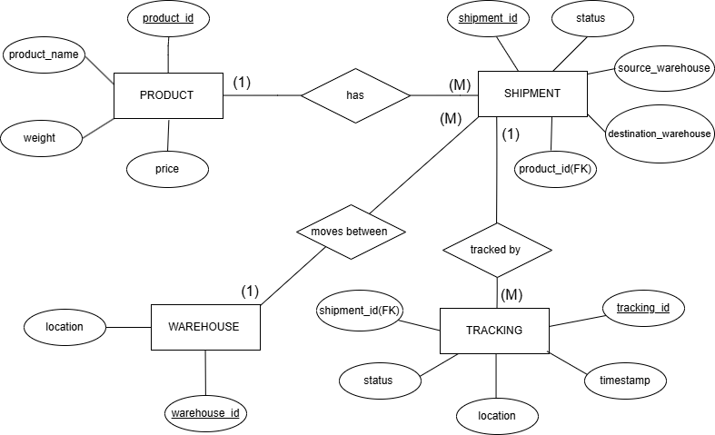

# Real-Time Logistics Tracking System

## Overview

A DBMS project designed to track products and shipments across multiple locations. The system stores product information, warehouse details, shipment records, and tracking updates using a relational database.

## Technologies Used

* MySQL
* SQL
* DBMS

## Features

* Product Management
* Warehouse Management
* Shipment Tracking
* Status Monitoring
* Tracking History
* SQL Reporting Queries

## ER Diagram

